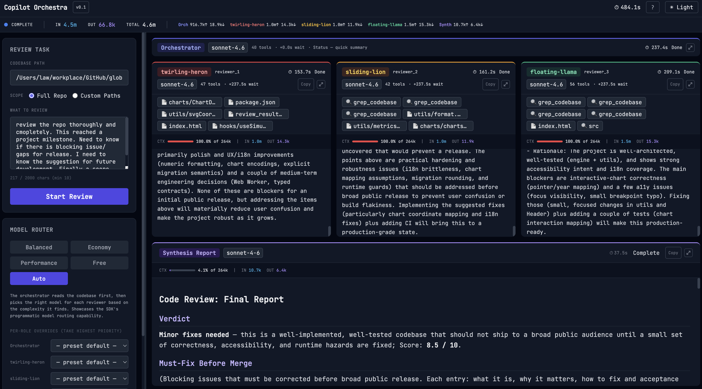

# Copilot Orchestra

Copilot Orchestra is a proof of concept built on the [GitHub Copilot SDK](https://github.com/github/copilot-sdk).
Its job is simple: take one coding task, fan it out to multiple Copilot-powered review roles,
and stream the full workflow into a UI that is easy to inspect.

This project is intentionally positioned as a learning and validation sandbox rather than a finished product.
It exists to explore how a multi-agent Copilot SDK workflow behaves in practice, what the SDK makes easy,
where orchestration needs more care, and how the experience feels when you expose the whole loop in real time.
It also makes it easier to test an important practical question: when should different roles use different models,
and how much control should the system keep versus the user?

Five Copilot sessions run in parallel:

- one Orchestrator to frame the task
- three focused reviewers for Architecture, Backend, and Frontend perspectives
- one Synthesizer to combine the findings into a final report



## Why This Exists

The main goal of this repository is to make Copilot SDK workflows concrete.
Instead of treating the SDK as a black box, this PoC shows the moving parts clearly:

- multi-session orchestration
- role-based prompting
- real-time event streaming over SSE
- model selection through a pluggable router
- token, context, and premium-request telemetry in the UI
- tool-driven codebase access with path safety controls

If you are evaluating whether the Copilot SDK can support more than a single chat loop,
this repo is meant to be a practical reference.

The model router is especially valuable here. In a multi-agent workflow, not every role has the same job,
latency tolerance, or cost profile. The router makes that explicit by letting the app:

- keep sensible defaults for a stable baseline
- swap models by preset when you want to compare speed, quality, or cost
- allow user overrides per role
- allow orchestrator-selected models at runtime in `auto` mode
- fail fast when a preset such as `free` cannot be satisfied

That turns model choice into something you can reason about and test, instead of a hardcoded implementation detail.

## What The App Shows

The UI presents the workflow as a visible pipeline:

- Orchestrator at the top
- three reviewer panels in parallel
- Synthesizer at the bottom

Each panel streams its own output, can be expanded for easier reading, and reports usage metrics.
The top metrics strip keeps labels deterministic and role-ordered:
`orchestrator`, `reviewer_1`, `reviewer_2`, `reviewer_3`, `synthesizer`.
Reviewer labels also mirror the same random `<action>-<animal>` names shown on the reviewer cards,
so the header and panel names stay aligned.

Recent UI tuning also improved readability and accessibility for secondary metadata such as timers,
status chips, badge labels, and usage details across both light and dark themes.

## Architecture At A Glance

```text
┌─ Web UI (React + Vite) ───────────────────────────────────┐
│  Task Input │ Model Router │ Metrics Bar                   │
│  ┌────────────────────────────────────────────────────────┐│
│  │                   Orchestrator                        ││
│  └────────────────────────────────────────────────────────┘│
│  ┌────────────┐ ┌─────────┐ ┌──────────┐                  │
│  │Architecture│ │ Backend │ │ Frontend │  ← 3 reviewers   │
│  └────────────┘ └─────────┘ └──────────┘                  │
│  ┌────────────────────────────────────────────────────────┐│
│  │                  Synthesis Report                     ││
│  └────────────────────────────────────────────────────────┘│
│  Each panel has a maximize button for expanded viewing    │
└───────────────────────── SSE ─────────────────────────────┘
                           │
┌─ FastAPI ─────────────────────────────────────────────────┐
│  POST /api/reviews   GET /api/events/{id}   GET /api/models│
└───────────────────────────────────────────────────────────┘
                           │
┌─ Orchestration Core (UI-agnostic) ────────────────────────┐
│  ModelRouter  │  SessionManager  │  EventBus               │
│  Orchestrator → Architecture + Backend + Frontend (∥)     │
│  → Synthesizer                                            │
└──────────────────── Copilot SDK ──────────────────────────┘
```

The backend orchestration layer is UI-agnostic. FastAPI handles transport and API boundaries,
while the orchestration core manages model selection, session lifecycle, event fan-out, and
agent coordination.

For this PoC, the router is one of the most useful pieces of infrastructure because it separates orchestration logic
from model policy. That makes it much easier to experiment with questions like whether the synthesizer should use a
stronger model, whether reviewers can run on cheaper models, or whether user overrides should win over runtime choices.

See [docs/ARCHITECTURE.md](docs/ARCHITECTURE.md) for the full design.

## Prerequisites

- Python 3.13+ with [uv](https://docs.astral.sh/uv/)
- Node.js 20+ with npm
- GitHub Copilot CLI installed and authenticated via `copilot auth status`
- or a BYOK API key, described below

## Quick Start

```bash
# Install Python dependencies
uv sync

# Configure environment
cp .env.example .env
# Edit .env if needed. Defaults work when Copilot CLI is already authenticated.

# Start backend
cd src
uv run uvicorn backend.main:app --reload --port 8000

# In another terminal, from the repo root, start frontend
cd src/frontend
npm install
npm run dev
```

Then open `http://localhost:5173`.

## One-Command Launch Scripts

If you want the fastest path to a running demo, use the helper scripts in `scripts/`.

```bash
./scripts/start-app.sh
```

```powershell
.\scripts\start-app.ps1
```

These scripts start the backend on `:8000` and the frontend on `:5173`, and shut down the backend
when the frontend process stops.

## BYOK Configuration

To run against your own provider instead of GitHub Copilot auth, set the following in `.env`:

```env
BYOK_PROVIDER_TYPE=anthropic          # openai | anthropic | azure
BYOK_API_KEY=sk-ant-...
BYOK_BASE_URL=                        # optional; provider default if empty
```

## Telemetry And Metrics

One purpose of this PoC is to make model behavior observable.
The frontend reports, per agent:

- context usage percentage
- input and output token counts
- premium-request usage
- estimated cost in Copilot SDK mode

Context-window telemetry is model-aware. The frontend reads each model limit from `GET /api/models`
using `capabilities.limits.max_context_window_tokens` and computes `CTX%` against that value.
If a model limit is unavailable, the UI falls back to `200k` to keep the display stable.

Usage rows are initialized as soon as each agent starts, so all five agents always show a metrics row,
including runs where a provider does not emit `assistant.usage` events.
The display format is explicit: `CTX <percent>% of <window>`.

> **Note on context window values:** `max_context_window_tokens` is the full raw model limit from the
> GitHub Copilot model catalog. VS Code's Context Usage widget may show a smaller effective budget
> because it reserves output capacity internally. Both numbers are valid for their specific purpose.
> This project uses the full catalog limit as the denominator for CTX%, which is the correct basis for
> measuring how much of the model's available context window is occupied.

## Model Presets

Presets are the most visible part of the router, but the router itself is doing more than simple preset lookup.
It applies a priority chain of user override, orchestrator choice, preset, then default model, which keeps model
selection predictable while still allowing the workflow to adapt at runtime.

| Preset | Orchestrator | Reviewer 1 | Reviewer 2 | Reviewer 3 | Synthesizer |
|--------|-------------|------------|------------|------------|-------------|
| balanced | sonnet | sonnet | sonnet | sonnet | sonnet |
| economy | haiku | haiku | haiku | haiku | haiku |
| performance | opus | opus | opus | opus | opus |
| free | discovered 0x model | discovered 0x model | discovered 0x model | discovered 0x model | discovered 0x model |
| auto | sonnet | *orch picks* | *orch picks* | *orch picks* | *orch picks* |

The `balanced` preset currently uses `claude-sonnet-4-6` for all roles through the default model router setup.
Per-role defaults can also be configured via environment variables such as `DEFAULT_ORCHESTRATOR_MODEL`
and `DEFAULT_SECURITY_MODEL`, with those values passed into the `ModelRouter` as `default_models`.

Individual roles can still be overridden in the UI regardless of the preset.

The `free` preset:

- uses SDK model discovery via `list_models`
- selects only models where `billing.multiplier == 0.0`
- fails fast when no free models are available for the current account

## Cost Model

In default Copilot SDK mode, cost is estimated from premium requests.
Each model turn consumes its `billing.multiplier`, and the UI shows:

`EST. COST = total_premium_requests × $0.04 USD`

That matches GitHub Copilot's premium request pricing model.

In BYOK mode, the UI does not attempt to show a dollar figure.
Instead, it reports token totals and leaves final pricing to the provider's own token rates.

The backend emits a `turns` counter from `ASSISTANT_USAGE` events, and the frontend combines that
with each model's `billing_multiplier` from `GET /api/models` to derive premium-request usage.

## Project Structure

```text
.
├── SPEC.md                     # Product specification
├── docs/
│   ├── ARCHITECTURE.md         # System architecture
│   ├── API_SPEC.yaml           # OpenAPI 3.0 spec
│   ├── EVENT_SCHEMA.md         # SSE event schema reference
│   └── adr/                    # Architecture Decision Records
├── src/
│   ├── backend/
│   │   ├── main.py                 # FastAPI entry point
│   │   ├── config.py               # Settings via pydantic-settings
│   │   ├── logging_config.py       # Structured logging setup
│   │   ├── api/                    # HTTP layer
│   │   ├── orchestration/          # UI-agnostic orchestration core
│   │   │   ├── model_router.py     # Model selection logic
│   │   │   ├── event_bus.py        # asyncio fan-out event bus
│   │   │   ├── session_manager.py  # CopilotClient lifecycle
│   │   │   ├── orchestrator.py     # Top-level review flow
│   │   │   └── agents/             # One module per agent role
│   │   └── tools/
│   │       └── codebase.py         # Path-safe file-system tools
│   └── frontend/
│       └── src/
│           ├── components/         # AgentPanel, MetricsBar, and related UI
│           └── hooks/useSSE.js     # EventSource hook
└── tests/
    ├── unit/                       # Fast tests, no CLI dependency
    └── integration/                # Requires authenticated Copilot CLI
```

## Running Tests

```bash
# Unit tests only
uv run pytest tests/unit -v

# Default suite excluding integration tests
uv run pytest -v -m "not integration"

# Unit tests with coverage
uv run pytest tests/unit --cov=src/backend --cov-report=term-missing
```

## Security

- file access is limited to explicitly registered root paths
- path traversal is blocked through `Path.resolve()` plus relative-path validation
- credentials are never logged
- BYOK keys are read from environment variables only, never request bodies
- the spec defines the baseline security rule set in [SPEC.md](SPEC.md#non-functional)

## Tool Path Compatibility

To make tool calls more reliable across different model families, the codebase tools accept both:

- absolute paths such as `/Users/me/repo/src/app.py`
- review-root-relative paths such as `src/app.py`

Path-bearing tools like `list_directory` and `git_diff` also default to the review root when `path`
is omitted. That helps reduce partial-argument failures while preserving the same path-safety model.

## Related Docs

- [SPEC.md](SPEC.md)
- [docs/ARCHITECTURE.md](docs/ARCHITECTURE.md)
- [docs/API_SPEC.yaml](docs/API_SPEC.yaml)
- [docs/EVENT_SCHEMA.md](docs/EVENT_SCHEMA.md)
